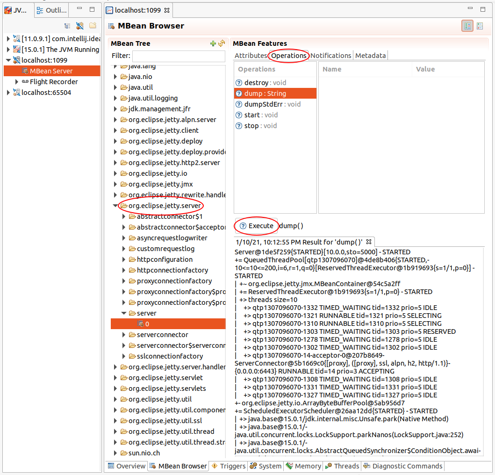

//
// ========================================================================
// Copyright (c) 1995-2022 Mort Bay Consulting Pty Ltd and others.
//
// This program and the accompanying materials are made available under the
// terms of the Eclipse Public License v. 2.0 which is available at
// https://www.eclipse.org/legal/epl-2.0, or the Apache License, Version 2.0
// which is available at https://www.apache.org/licenses/LICENSE-2.0.
//
// SPDX-License-Identifier: EPL-2.0 OR Apache-2.0
// ========================================================================
//

[[og-troubleshooting-dump]]
==== Server Dump

The Jetty Server Dump is obtained by invoking, via JMX, the `Server.dump()` operation, as shown below.

Find the `Server` MBean in the MBean Tree, under `org.eclipse.jetty.server:type=server,id=0`.
Then click on the "Operations" tab, select the `dump()` operation, and then click the `Execute` button.
In the bottom panel you will see the result of the invocation, that you can copy into a text editor and save to your file system.

[CAUTION]
====
Taking a Jetty Server Dump is a relatively expensive operation, as it dumps the state of all connections (which can be thousands), and the state of all threads.

The result of the invocation may produce a large string, possibly few MiB, that may impact the server memory usage.

Furthermore, dumping the state of the I/O Jetty components takes a little CPU time off the handling of the actual I/O, possibly slowing it down temporarily.

While the slow-down caused by taking the Jetty Server Dump may be noticeable on highly loaded systems, it is typically a very small price to pay to obtain the information about the Jetty state that may be critical to the resolution of an issue.
====

[NOTE]
====
The format of the Jetty Server Dump output is subject to change at any time, as Jetty developers modify the Jetty code and decide to include more state, or remove state that is no longer relevant.

The Jetty Server Dump is organized in a tree whose structure is similar to the runtime Jetty component tree.

At the end of the dump output there is a legend that explains the type of tree node: whether it is a node that represent a _managed_ component, or an _array_ node (or a _map_ node) that represent some component state, etc.
====

[[og-troubleshooting-dump-start-stop]]
===== Dump at Server Start/Stop

The `Server.dump()` operation may also be invoked just after the `Server` starts (to log the state of the freshly started server), and just before the `Server` stops (which may be useful to log the state of server that is not working properly).

You can temporarily enable the Jetty Server Dump at start time by overriding the `jetty.server.dumpAfterStart` property on the command line:

[source,subs=quotes]
----
$ java -jar $JETTY_HOME/start.jar *jetty.server.dumpAfterStart=true*
----

To make this change persistent across server restarts, see the xref:og-module-server[`server` module] configuration for more information about how to configure the server to dump at start/stop time.

[[og-troubleshooting-dump-detailed]]
===== Detailed ThreadPool Information

By default, the dump of the thread pool will only dump the topmost stack frame of each thread.
It is possible to configure the thread pool to dump the whole stack trace for each thread; while this may be a little more expensive, it provides complete information about the state of each thread, which may be important to diagnose the issue.

See the xref:og-module-threadpool[`threadpool` module] configuration for more information about how to configure the thread pool to dump detailed thread information.

Detailed thread pool information can also be turned on/off on-the-fly via JMX, by finding the `ThreadPool` MBean under `org.eclipse.jetty.util.thread:type=queuedthreadpool,id=0`, then selecting the `detailedDump` attribute and setting it to `true`. You can now perform the `Server.dump()` operation as explained above, and then set `detailedDump` back to `false`.

[[og-troubleshooting-dump-example]]
===== Dump Example

Below you can find a simple example of a Jetty Server Dump, with annotations for the principal components:

[source,subs=verbatim,role=small,options=nowrap]
----
include::jetty[setupArgs="--add-modules=http",args="jetty.http.selectors=1 jetty.http.acceptors=1 jetty.threadPool.minThreads=4 jetty.server.dumpAfterStart=true",delete="^[0-9]{4}",callouts=" <$N>,Server@,= QueuedThreadPool,HandlerList@,= ServerConnector,ManagedSelector@,keys @,startJarLoader@,unmanaged"]
----
<1> The `Server` instance at the root of the tree
<2> The thread pool component
<3> The root of the `Handler` structure
<4> The connector listening on port `8080` for the HTTP/1.1 protocol
<5> A selector component that manages connections
<6> The connections currently managed by the selector component
<7> The server `ClassLoader` and its classpath
<8> The legend for the dump nodes
