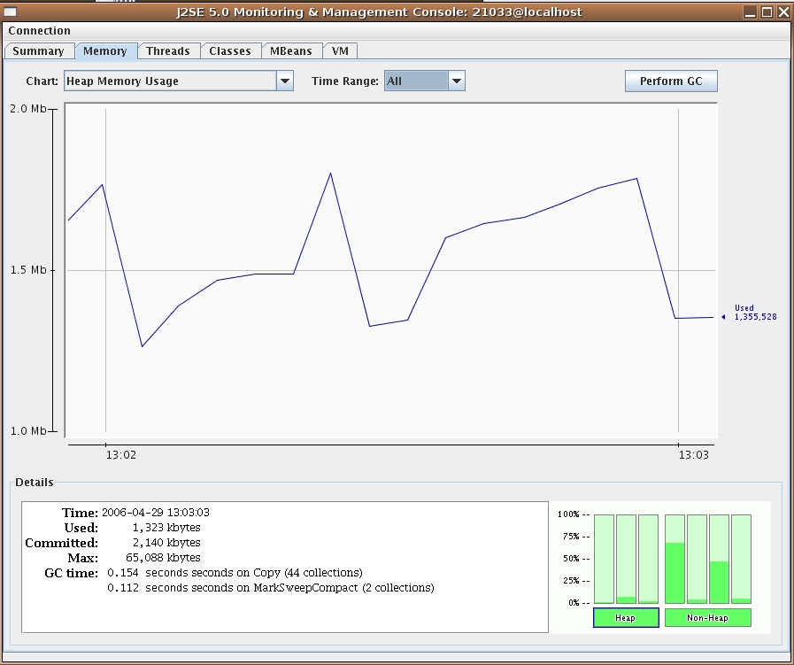

//  ========================================================================
//  Copyright (c) 1995-2016 Mort Bay Consulting Pty. Ltd.
//  ========================================================================
//  All rights reserved. This program and the accompanying materials
//  are made available under the terms of the Eclipse Public License v1.0
//  and Apache License v2.0 which accompanies this distribution.
//
//      The Eclipse Public License is available at
//      http://www.eclipse.org/legal/epl-v10.html
//
//      The Apache License v2.0 is available at
//      http://www.opensource.org/licenses/apache2.0.php
//
//  You may elect to redistribute this code under either of these licenses.
//  ========================================================================

[[jetty-jconsole]]
=== Jetty JConsole

JConsole is a graphical tool; it allows you to remotely manage and monitor your server and web application status using JMX. 
When following the instructions given below, please also ensure that you make any necessary changes to any anti-virus software you may be using which may prevent jconsole from running.

[[jetty-jconsole-monitoring]]
==== Monitoring Jetty with JConsole

To monitor Jetty's server status with JConsole, make sure JConsole is running, and start Jetty with a special system property.

===== Starting Jetty Standalone

The simplest way to enable support is to add the jmx support module to your $\{jetty.base}.

....
[mybase]$ java /opt/jetty-dist/start.jar --add-to-start=jmx
INFO: jmx-remote      initialised in ${jetty.base}/start.ini (appended)
INFO: jmx             initialised transitively
....

Then open the $\{jetty.base}/start.ini file and edit the properties to suit your needs:

....

#
# Initialize module jmx-remote
#
--module=jmx-remote
## JMX Configuration
## Enable for an open port accessible by remote machines
jetty.jmxrmihost=localhost
jetty.jmxrmiport=1099
## Strictly speaking you shouldn't need --exec to use this in most environments.
## If this isn't working, make sure you enable --exec as well
-Dcom.sun.management.jmxremote
    
....

===== Starting the Jetty Maven Plugin

If you are running the Jetty Maven Plugin, you must set the system property com.sun.management.jmxremote on Maven before running the plugin. 
The way to do this is to set your MAVEN_OPTS environment variable (if you're not sure how to do this, consult the  Maven documentation).

Here is an example that sets the system property on the fly in a BASH shell, before starting Jetty via the plugin:

....

$ export MAVEN_OPTS=-Dcom.sun.management.jmxremote
$ mvn jetty:run
$ jconsole &        # runs jconsole in the background 
      
....

===== Connecting to your server process

When you start Jetty, you see a dialog box from JConsole with a list of running processes to which you can connect. It should look something like so:

image:images/jconsole1.jpg[image,width=576]

____
[IMPORTANT]
If you don't see your Jetty process in the list of processes you can
connect to, quickly switch tabs, or close and reopen a new "New
Connection" dialog window. This forces JConsole to refresh the list, and
recognize your newly-started Jetty process.
____

Select the start.jar entry and click the "Connect" button. 
A new JConsole window opens:

From this window you can monitor memory usage, thread usage, classloading and VM statistics. 
You can also perform operations such as a manual garbage collect. 
JConsole is an extremely powerful and useful tool.

==== Managing Jetty Objects with JConsole

The MBean tab of JConsole allows access to managed objects within the Java application, including MBeans the JVM provides. 
If you also want to interact with the Jetty JMX implementation via JConsole, you need to start Jetty JMX in a form that JConsole can access. 
See xref:using-jmx[] for more information.
