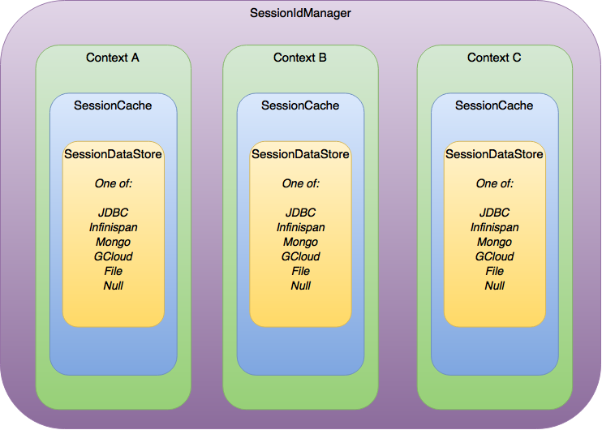

//  ========================================================================
//  Copyright (c) 1995-2016 Mort Bay Consulting Pty. Ltd.
//  ========================================================================
//  All rights reserved. This program and the accompanying materials
//  are made available under the terms of the Eclipse Public License v1.0
//  and Apache License v2.0 which accompanies this distribution.
//
//      The Eclipse Public License is available at
//      http://www.eclipse.org/legal/epl-v10.html
//
//      The Apache License v2.0 is available at
//      http://www.opensource.org/licenses/apache2.0.php
//
//  You may elect to redistribute this code under either of these licenses.
//  ========================================================================

[[jetty-sessions-architecture]]
=== Session Architecture

// TODO: Remove in Jetty 9.5/10 - This paragraph is dated and only really useful for upgrading into 9.4 from prior versions.
==== Changes in Session Architecture
The architecture of Session Management Jetty changed significantly in Jetty 9.4.
These changes have resulted in Sessions not only being easier to configure but making them much more pluggable for various technologies.

In previous versions of Jetty, users were required to configure a separate `SessionIdManager` for each kind of session clustering technology being implemented (JDBC, MongoDB..etc.).
In Jetty 9.4, there is now a single `SessionIdManager` implementation which works across all types of session clustering technologies.
Likewise, prior to Jetty 9.4 there were several different instances of the `SessionManager` class.
Instead of a single `SessionManager` though, it has been done away with entirely, with most of it's functionality moved to the `SesssionHandler` class.
Additionally, Jetty 9.4 introduced the concepts of a `SessionCache` and an associated `SessionDataStore` (both explained below).

Finally, Session scavenging has been re-worked.
Where previously each `SessionManager` instance would periodically scan the in-memory (or clustered) sessions for expired sessions, there is now a single generic scavenger thread which instructs the `SessionHandler` to clean up expired sessions.
Session expiration has been changed to use a much more efficient timer-based mechanism that avoids constant iteration over all current sessions in memory by the scavenger.

==== Session Architecture Hierarchy

Each Jetty instance has a singular `SessionIdManager` to handle all session requests, regardless of clustering technology.
For each context on the server there is one (1) `SessionCache` which contains all of the Session objects for the given context.
The benefit of the `SessionCache` is to ensure that simultaneous requests accessing the same Session Id in the same context always operate on the same Session object.
The SessionCache implementation supplied with the Jetty distribution does just that: keeps Session objects in memory so that they can be shared between simultaneous requests.
However, it is possible to provide your own implementation that never shares Session objects should you require it.

Where the `SessionCache` handles Session information, Session data is stored in a `SessionDataStore` that is specific to the clustering technology being implemented.
There is only one (1) `SessionDataStore` per `SessionCache`.

Visually the session architecture can be represented like this:

==== Configuring Sessions in the Jetty Distribution

Jetty provides support for several different Session Management technologies.
Both link:#configuring-sessions-file-system[local file storage] and in-memory session management can be implemented for standard implementations.
For implementations using clustered technologies, link:#configuring-sessions-jdbc[JDBC], link:#configuring-sessions-mongo[MongoDB], link:#configuring-sessions-infinispan[Inifinispan] and link:#configuring-sessions-gcloud[Google Cloud Datastore] are all supported.
Setting up these technologies is as easy as enabling it's link:#startup-modules[module] and editing it's associated ini file with any usernames, passwords or changes you need to make for your instance.
The following sections will cover how exactly to enable the required modules as well as an overview of what options are available for customization.
