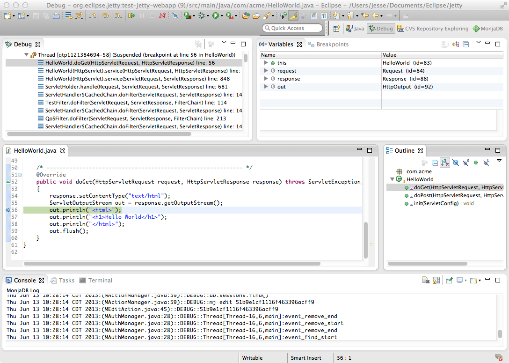

//  ========================================================================
//  Copyright (c) 1995-2016 Mort Bay Consulting Pty. Ltd.
//  ========================================================================
//  All rights reserved. This program and the accompanying materials
//  are made available under the terms of the Eclipse Public License v1.0
//  and Apache License v2.0 which accompanies this distribution.
//
//      The Eclipse Public License is available at
//      http://www.eclipse.org/legal/epl-v10.html
//
//      The Apache License v2.0 is available at
//      http://www.opensource.org/licenses/apache2.0.php
//
//  You may elect to redistribute this code under either of these licenses.
//  ========================================================================

[[debugging-with-eclipse]]
=== Debugging With Eclipse

There are a number of options available to debug your application in Eclipse.

If not done already prepare your application for remote debugging as described here: xref:enable-remote-debugging[]

==== Linking with Eclipse

Next we need to link the Eclipse project with the deployed webapp.

1.  Within Eclipse, right-click on the project containing the webapp deployed into jetty and select *Debug -> Debug Configurations* and create a new configuration of **Remote Java Application**.
Make sure the port you choose is the same as the one you added in xref:enable-remote-debugging[].
+
image:images/debug-eclipse-1.png[image,width=576]

2.  Next in your webapp you can set a breakpoint within a servlet which when it is tripped will halt the remote jvm's processing thread to await for debugging commands from your Eclipse instance.
+
image:images/debug-eclipse-2.png[image,width=576]

3.  Accessing that servlet within your browser, pointed at your remote debug configurated jetty-distribution, should transition your Eclipse instance to the standard Debug view.
+

[[eclipse-within-eclipse]]
==== Within Eclipse

Since Jetty can be incredibly simple to embed, many people choose to create a small `main` method which they can launch directly within Eclipse in order to more easily debug their entire application.
The best place to get started on this approach is to look through xref:embedding-jetty[] and the xref:embedded-examples[] sections.

Once you have a main method defined in order to launch your application, right-click on the source file and select**Debug As -> Java Application**.
In your *Console* tab within Eclipse you should see your application startup and once it has completed startup you should be able to configure breakpoints and hit the Jetty instance as normal via your web browser.

____
[TIP]
You can easily configure logging through a `jetty-logging.properties`
file. If this file is on your classpath then Jetty will use it for
configuring logging, we use this approach extensively throughout Jetty
development and it makes life ever so much easier. You can see this in
action in the xref:configuring-jetty-stderrlog[] section.
____