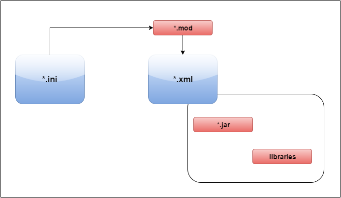

//  ========================================================================
//  Copyright (c) 1995-2016 Mort Bay Consulting Pty. Ltd.
//  ========================================================================
//  All rights reserved. This program and the accompanying materials
//  are made available under the terms of the Eclipse Public License v1.0
//  and Apache License v2.0 which accompanies this distribution.
//
//      The Eclipse Public License is available at
//      http://www.eclipse.org/legal/epl-v10.html
//
//      The Apache License v2.0 is available at
//      http://www.opensource.org/licenses/apache2.0.php
//
//  You may elect to redistribute this code under either of these licenses.
//  ========================================================================

[[quickstart-config-how]]
=== How to Configure Jetty

To understand Jetty configuration, you need to understand the "How" and the "What".
This section covers how to configure Jetty in terms of what mechanisms exist to perform configuration.
The link:#quickstart-config-what[next section] gives an overview of the action components and fields that you can configure with these mechanisms.

==== Jetty POJO Configuration

The core components of Jetty are Plain Old Java Objects (http://en.wikipedia.org/wiki/Plain_Old_Java_Object[POJOs])
The process of configuring Jetty is mostly the process of instantiating, assembling and setting fields on the Jetty POJOs.
This can be achieved by:

* Writing Java code to directly instantiate and assemble Jetty objects.
This is referred to as xref:embedding-jetty[].
* Using Jetty XML configuration, which is an http://en.wikipedia.org/wiki/Inversion_of_Control[Inversion of Control (IoC)] framework, to instantiate and assemble Jetty objects as XML objects.
The `etc/jetty.xml` file is the main Jetty XML configuration file, but there are many other `etc/jetty-__feature__.xml` files included in the Jetty distribution.
* Using a third party http://en.wikipedia.org/wiki/Inversion_of_Control[IoC] framework like http://en.wikipedia.org/wiki/Spring_Framework[Spring], to instantiate and assemble Jetty objects as Spring beans.

Because the main Jetty configuration is done by IoC, the link:{JDURL}/[Jetty API documentation] is the ultimate configuration reference.

==== Jetty Start Configuration Files

The Jetty distribution uses the following configuration files to instantiate, inject and start server via the `start.jar` mechanism.

`ini` files::
  The Jetty Start mechanism uses the command line, the `$JETTY_BASE/start.ini` and/or `$JETTY_BASE/start.d/*.ini` files to create an effective command line of arguments.
  Arguments may be:

  * Module activations in the form `--module=name`
  * Properties in the form of `name=value`, used to parameterize Jetty IoC XML
  * XML files in Jetty IoC (or Spring) XML format
  * A standard http://en.wikipedia.org/wiki/Java_properties[Java property file] containing additional start properties
  * Other start.jar options (see `java -jar start.jar --help`)
  * Some JVM options in combination with `--exec`, such as `-Xbootclasspath`.

____
[NOTE]
--
It is the `ini` files located in the Jetty base directory (if different from Jetty home) that are typically edited to change the configuration (e.g. change ports). 
--
____

`mod` files::
  The `$JETTY_HOME/modules/*.mod` files contain the definition of modules that can be activated by `--module=name`.
  Each `mod` file defines:

  * Module dependencies for ordering and activation
  * The libraries needed by the module to be added to the classpath
  * The XML files needed by the module to be added to the effective command line
  * Files needed by the activated module
  * A template `ini` file to be used when activating the `--add-to-start=name` option
+
Typically module files are rarely edited and only then for significant structural changes.
The `*.mod` files are normally located in `$JETTY_HOME/modules/`, but extra or edited modules may be added to `$JETTY_BASE/module`.
If module changes are required, it is best practice to copy the particular `*.mod` file from `$JETTY_HOME/modules/` to `$JETTY_BASE/modules/` before being modified.

XML files::
  XML files in link:#jetty-xml-syntax[Jetty IoC XML format] or Spring IoC format are listed either on the command line, in `ini` files, or are added to the effective command line by a module definition.
  The XML files instantiate and inject the actual Java objects that comprise the server, connectors and contexts.
  Because Jetty IoC XML files use properties, most common configuration tasks can be accomplished without editing these XML files and can instead be achieved by editing the property in the corresponding `ini` files.
  XML files are normally located in `$JETTY_HOME/etc/`, but extra or edited XML files may be added to `$JETTY_BASE/etc/`.
  *Note* If XML configuration changes are required, it is best practice to copy the XML file from `$JETTY_HOME/etc/` to `$JETTY_BASE/etc/` before being modified.

Below is an illustration of how the various Jetty configuration files (`ini`, `mod` and XML) are related:

==== Other Configuration Files

In addition to the configuration files described above, the configuration of the server can use the following file types:

Context XML files::
  Any XML files in link:#jetty-xml-syntax[Jetty IoC XML format] or Spring IoC format that is discovered in the `/webapps` directory are used by the deploy module to instantiate and inject `HttpContext` instances to create a specific context.
  These may be standard web applications or bespoke contexts created from special purpose handlers.

web.xml::
  The http://en.wikipedia.org/wiki/Servlet[Servlet] Specification defines the http://en.wikipedia.org/wiki/Web.xml[`web.xml`] deployment descriptor that defines and configures the filters, servlets and resources a http://en.wikipedia.org/wiki/Web_application[web application] uses.
  The Jetty `WebAppContext` component uses this XML format to:

  * Set up the default configuration of a web application context.
  * Interpret the application-specific configuration supplied with a web application in the `WEB-INF/web.xml` file.
  * Interpret descriptor fragments included in the `META-INF` directory of Jar files within `WEB-INF/lib.`
+
Normally the `web.xml` file for a web application is found in the `WEB-INF/web.xml` location within the war file/directory or as `web.xml` fragments with `.jar` files found in `WEB-INF/lib`.
Jetty also supports multiple `web.xml` files so that a default descriptor may be applied before `WEB-INF/web.xml` (typically set to `etc/webdefault.xml` by the deploy module) and an override descriptor may be applied after `WEB-INF/web.xml` (typically set by a context XML file see `test.xml`)

Property Files::
  Standard http://en.wikipedia.org/wiki/Java_properties[Java property files] are also used for Jetty configuration in several ways:
+
  * To parameterize Jetty IoC XML via the use of the `Property` element.
  * To configure the default logging mechanism (`StdErrLog`). Other logging frameworks can be utilized and also use property files (for example, `log4j`).
  * As a simple database for login usernames and credentials.

==== Jetty IoC XML format

To understand the link:#jetty-xml-syntax[Jetty IoC XML format], consider the following example of an embedded Jetty server instantiated and configured in Java:

[source, java, subs="{sub-order}"]
----
include::{SRCDIR}/examples/embedded/src/main/java/org/eclipse/jetty/embedded/ExampleServer.java[]
----

link:#jetty-xml-syntax[Jetty IoC XML format] allows you to instantiate and configure the exact same server in XML without writing any java code:

[source, xml, subs="{sub-order}"]
----
include::{SRCDIR}/examples/embedded/src/main/resources/exampleserver.xml[]
----

//In practice, most commonly used Jetty features have XML files that are included in the standard distribution in the `/etc` directory.
//Thus configuring Jetty is often a matter of just editing existing XML files and altering the property values injected into them.
