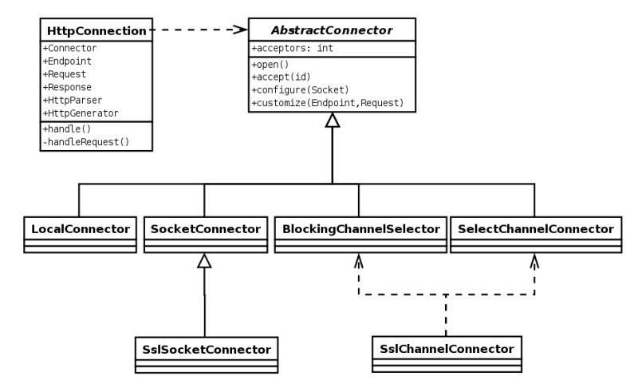

//  ========================================================================
//  Copyright (c) 1995-2016 Mort Bay Consulting Pty. Ltd.
//  ========================================================================
//  All rights reserved. This program and the accompanying materials
//  are made available under the terms of the Eclipse Public License v1.0
//  and Apache License v2.0 which accompanies this distribution.
//
//      The Eclipse Public License is available at
//      http://www.eclipse.org/legal/epl-v10.html
//
//      The Apache License v2.0 is available at
//      http://www.opensource.org/licenses/apache2.0.php
//
//  You may elect to redistribute this code under either of these licenses.
//  ========================================================================

[[basic-architecture]]
=== Jetty Architecture

==== View from 20,000 feet 

The Jetty link:{JDURL}/org/eclipse/jetty/server/Server.html[Server] is the plumbing between a collection of Connectors that accept HTTP connections and a collection of Handlers that service requests from the connections and produce responses, with threads from a thread pool doing the work.

image:images/jetty-high-level-architecture.png[image,width=576]

While the Jetty request/responses are derived from the Servlet API, the full features of the Servlet API are only available if you configure the appropriate handlers. 
For example, the session API on the request is inactive unless the request has been passed to a Session Handler. 
The concept of a servlet itself is implemented by a Servlet Handler. 
If servlets are not required, there is very little overhead in the use of the servlet request/response APIs. 
Thus you can build a Jetty server using only connectors and handlers, without using servlets.

The job of configuring Jetty is building a network of connectors and handlers and providing their individual configurations. 
As Jetty components are simply Plain Old Java Objects (POJOs), you can accomplish this assembly and configuration of components by a variety of techniques:

* In code. See the examples in the Jetty 7 Latest Source XRef.
* Using Jetty XML–dependency injection style XML format.
* With your dependency injection framework of choice: Spring or XBean.
* Using Jetty WebApp and Context Deployers.

==== Patterns

The implementation of Jetty follows some fairly standard patterns. 
Most abstract concepts such as Connector, Handler and Buffer are captured by interfaces. 
Generic handling for those interfaces is then provided in an Abstract implementation such as `AbstractConnector`, `AbstractHandler` and ` AbstractBuffer`.

image:images/basic-architecture-patterns.png[image,width=576]

The JSR77 inspired life cycle of most Jetty components is represented by the `LifeCycle` interface and the `AbstractLifeCycle` implementation used as the base of many Jetty components.

Jetty provides its own IO Buffering abstract over String, byte arrays and NIO buffers. 
This allows for greater portability of Jetty as well as hiding some of the complexity of the NIO layer and its advanced features.

==== Connectors

This diagram is a little out of date, as a Connection interface has been extracted out of ` HttpConnector` to allow support for the AJP protocol.

The connectors represent the protocol handlers that accept connections, parse requests and generate responses. The different types of connectors available are based on the protocols, scheduling model, and IO APIs used:

* `SocketConnector` –for few busy connections or when NIO is not available
* `BlockingChannelConnector` –for few busy connections when NIO is available
* `SelectChannelConnector` –for many mostly idle connections or asynchronous handling of Ajax requests
* `SslSocketConnector` –SSL without NIO
* `SslSelectChannelConnector` –SSL with non blocking NIO support
* `AJPConnector` –AJP protocol support for connections from apache mod_jk or mod_proxy_ajp

==== Handlers

The Handler is the component that deals with received requests. The core API of a handler is the handle method:

image:images/basic-architecture-handlers.png[image,width=576]

[source, java, subs="{sub-order}"]
----

public void handle(String target, Request baseRequest, HttpServletRequest request, HttpServletResponse response) throws IOException, ServletException

      
      
----

Parameters:

* target–The target of the request, either a URI or a name.
* baseRequest–The original unwrapped request object.
* request–The request either as the Request object or a wrapper of that request. 
You can use the HttpConnection.getCurrentConnection() method to access the Request object if required.
* response–The response as the Response object or a wrapper of that request. 
You can use the HttpConnection.getCurrentConnection() method to access the Response object if required.

An implementation of this method can handle the request, pass the request onto another handler (or servlet) or it might modify and/or wrap the request and then pass it on. 
This gives three styles of Handler:

* Coordinating Handlers–Handlers that route requests to other handlers (HandlerCollection, ContextHandlerCollection)
* Filtering Handlers–Handlers that augment a request and pass it on to other handlers (HandlerWrapper, ContextHandler, SessionHandler)
* Generating Handlers–Handlers that produce content (ResourceHandler and ServletHandler)

===== Nested Handlers and Handlers Called Sequentially

You can combine handlers to handle different aspects of a request by nesting them, calling them in sequence, or by combining the two models.

image:images/basic-architecture-nested-handlers.png[image,width=576]

Handlers called in sequence perform actions that do not depend on the next invocation, nor on the handler order. 
They handle a request and generate the response without interacting with other handlers. 
The main class for this model is Handler Collection.

Nested handlers are called according to a before/invokeNext/after pattern. 
The main class for nested handlers is Handler Wrapper. 
Nested handlers are much more common than those called in sequence.

See also xref:writing-custom-handlers[].

===== Servlet Handler

The ServletHandler is a Handler that generates content by passing the request to any configured filters and then to a Servlet mapped by a URI pattern.

image:images/basic-architecture-servlet-handler.png[image,width=576]

A ServletHandler is normally deployed within the scope of a servlet Context, which is a ContextHandler that provides convenience methods for mapping URIs to servlets.

Filters and Servlets can also use a RequestDispatcher to reroute a request to another context or another servlet in the current context.

[[what-is-a-context]]
==== Contexts

Contexts are handlers that group other handlers below a particular URI context path or a virtual host. Typically a context can have:

* A context path that defines which requests are handled by the context (eg /myapp )
* A resource base for static content (a docroot)
* A class loader to obtain classes specific to the context (typically docroot/WEB-INF/classes)
* Virtual host names

Contexts implementations include:

* ContextHandler
* Servlet Context
* Web Application Context

A web application context combines handlers for security, session and servlets in a single unit that you can configure with a `web.xml` descriptor.

==== Web Application

A WebApp Context is a derivation of the servlet Context that supports the standardized layout of a web application and configuration of session, security, listeners, filter, servlets, and JSP via a `web.xml` descriptor normally found in the `WEB-INF` directory of a webapplication.

image:images/basic-architecture-web-application.png[image,width=576]

Essentially the WebAppContext is a convenience class that assists the construction and configuration of other handlers to achieve a standard web application configuration. 
Configuration is actually done by pluggable implementations of the Configuration class and the prime among these is `WebXmlConfiguration.`
