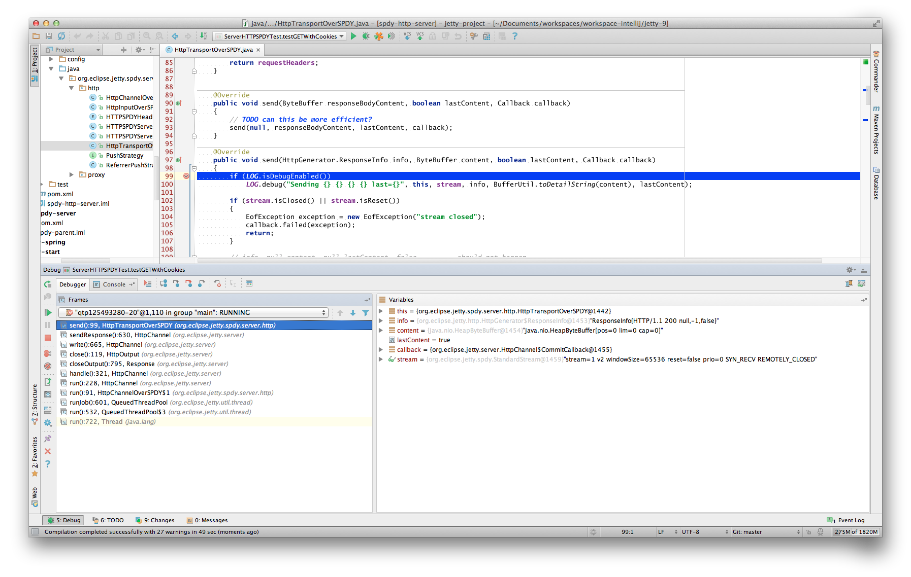

//  ========================================================================
//  Copyright (c) 1995-2016 Mort Bay Consulting Pty. Ltd.
//  ========================================================================
//  All rights reserved. This program and the accompanying materials
//  are made available under the terms of the Eclipse Public License v1.0
//  and Apache License v2.0 which accompanies this distribution.
//
//      The Eclipse Public License is available at
//      http://www.eclipse.org/legal/epl-v10.html
//
//      The Apache License v2.0 is available at
//      http://www.opensource.org/licenses/apache2.0.php
//
//  You may elect to redistribute this code under either of these licenses.
//  ========================================================================

[[debugging-with-intellij]]
=== Debugging With IntelliJ

There are a number of options available to debug your application in IntelliJ.

If not done already prepare your application for remote debugging as described here: xref:enable-remote-debugging[]

==== Linking with IntelliJ

Next we need to link the IntelliJ project with the deployed webapp.

1.  Within IntelliJ, open the project containing the webapp deployed into jetty that you want to debug. Select**Run -> Edit Configurations**.
Add a new configuration by clicking the "+" icon. Choose **Remote**.
Make sure the port you choose is the same as the one you added in xref:enable-remote-debugging[].
+
image:images/intellij_new_remote_config.png[image,width=800]

2.  Next in your webapp you can set a breakpoint within a servlet which when it is tripped will halt the remote jvm's processing thread to await for debugging commands from your IntelliJ instance.
To set a breakpoint, simply open the servlet or any other class you want to debug and click left to the line you want to set the breakpoint at (where the red dot is on the next screenshot).
The red dot and red background on the line mark the breakpoint.
+
image:images/intellij_set_breakpoint.png[image,width=800]

3.  Accessing that servlet within your browser, pointed at your remote debug configured jetty-distribution, should transition your IntelliJ instance to the standard debugger view.
+

[[intellij-within-intellij]]
==== Within IntelliJ

Since Jetty can be incredibly simple to embed, many people choose to create a small `main` method which they can launch directly within IntelliJ in order to more easily debug their entire application.
The best place to get started on this approach is to look through xref:embedding-jetty[] and the xref:embedded-examples[] sections.

Once you have a main method defined in order to launch your application, open the source file and right-click the main method.
Select *Debug* or simply hit CTRL+SHIFT+D.
In your *Console* tab within IntelliJ you should see your application startup and once it has completed startup you should be able to configure breakpoints and hit the Jetty instance as normal via your web browser.
The same thing works for unit tests.
Instead of the main method run debug on the test method you want to debug.

image:images/intellij_select_debug.png[image,width=800]

Debugging in IntelliJ is extremely powerful.
For example it's possible to have conditional breakpoints that only trigger a break if the configured conditions are met.
Have a look at the various tutorials in the internet or the http://www.jetbrains.com/idea/webhelp/getting-help.html[IntelliJ documentation] for further details.

____
[TIP]
You can easily configure logging through a `jetty-logging.properties` file.
If this file is on your classpath then Jetty will use it for configuring logging, we use this approach extensively throughout Jetty development and it makes life ever so much easier.
You can see this in action in the xref:configuring-jetty-stderrlog[] section.
____